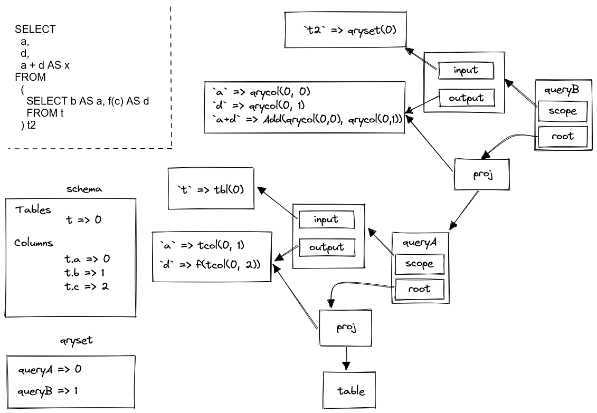
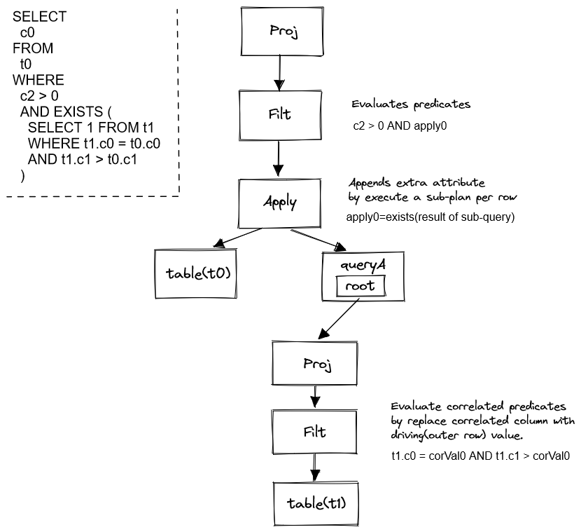
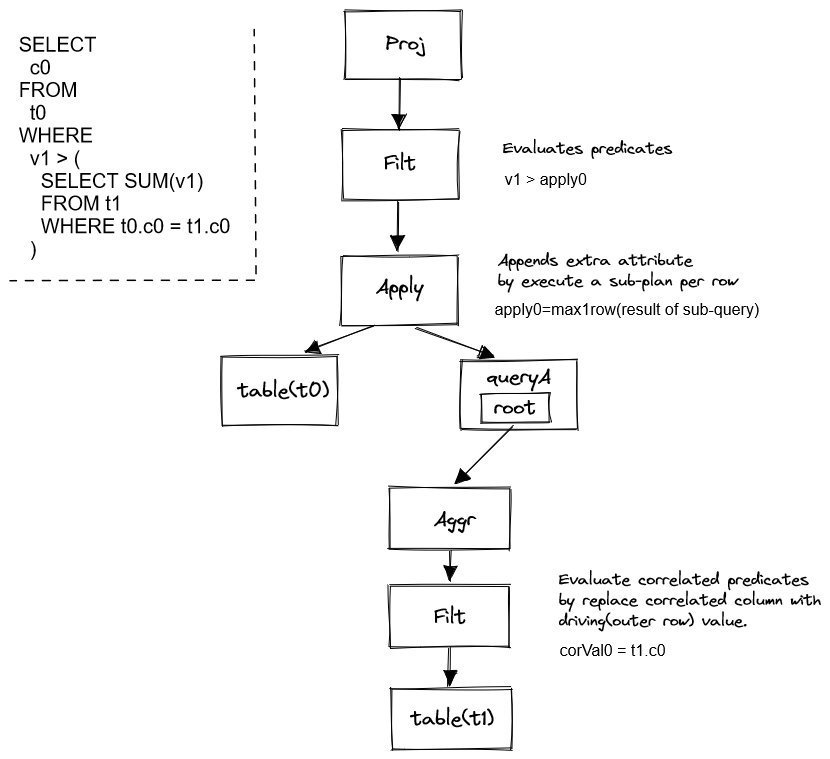

## Plan Builder

Plan builder is the component to initialize a logical plan from a given AST.

The build process includes:

- Name resolution.

General name resolution of a query includes below steps:

1. Resolve table aliases in FROM clause.

All tables will be assigned one alias. Duplicated aliases are not allowed for simplicity.

2. Resolve SELECT clause.

a) Expand asterisk.
b) Collect aggregation functions.
c) Collect expression aliases.

3. Resolve WHERE clause.

4. Resolve GROUP BY clause. Columns other than group items are not allowed.

5. Resolve HAVING clause.

6. Resolve ORDER BY clause.

7. Resolve LIMIT clause.

Currently WINDOW clause is not supported.

- Operator tree construction.

Operators include: Proj, Filt, Sort, Limit, Aggr, etc.

Instead of constructing a deep tree, arena is used to separate subqueries from
its parent tree. In this way, traversing an operator tree is very easy as the tree is simple. 

Here is a sample query and its tree layout:

```sql
SELECT
  a,
  d,
  a + d AS x
FROM
  (
    SELECT b AS a, f(c) AS d
    FROM t
  ) t2
```



In this design, expressions are passed between plans by position. Optimization like column pruning must take care of position updates.

- Correlated subquery.

The normal way to handle correlated subquery is to convert it to Apply operator.

Example 1:

```sql
SELECT
  c0
FROM
  t0
WHERE 
  c2 > 0
  AND EXISTS (
    SELECT 1 FROM t1
    WHERE t1.c0 = t0.c0
    AND t1.c1 > t0.c1
  )
```



Example 2:

```sql
SELECT
  c0
FROM
  t0
WHERE
  v1 > (
    SELECT SUM(v1)
    FROM t1
    WHERE t0.c0 = t1.c0
  )
```



It's easy to generate and execute, but the performance is really bad, due to the nature of nested-loop execution model.

Therefore, most databases implemented some "unnesting" techniques, but not able to handle all scenarios as the subqueries could be very nested and complex.

Until 2015, HyPer team published paper "Unnesting Arbitrary Subqueries" and announced that all subqueries can be unnested.

In that paper, correlated subqueries are called dependent join, and the core of unnesting technique is:
1. Generate a duplicate-free intermediate table(called D) from the left
(outer) table.
2. Convert dependent join to a normal join and another dependent join
   between D and inner table.
3. perform pull-up and push-down to convert the new dependent join into
   a normal join.
4. D table could be eliminated entirely if unique key exists.

We will follow and implement this technique to "unnest arbitrary subqueries".
